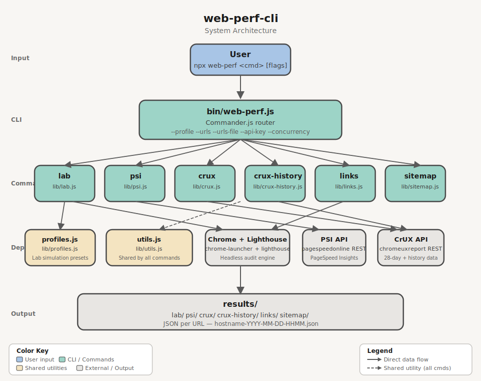

# web-perf-cli

[](https://www.npmjs.com/package/@hugoer/web-perf-cli)
[](https://www.npmjs.com/package/@hugoer/web-perf-cli)
[](https://nodejs.org)
[](./LICENSE)
[](https://github.com/Hugoer/web-perf-cli/actions/workflows/test.yml)

Node.js CLI and library for web performance auditing. Analyze any website using local Lighthouse audits, real-user metrics from PageSpeed Insights, Chrome UX Report data via the CrUX API, or extract URLs from sitemaps and rendered pages.



## Requirements

- **Node.js** >= 18
- **Google Chrome** installed locally (required for `lab` and `links`)
- **Google Cloud API key** with PageSpeed Insights API and/or CrUX API enabled (required for `psi`, `crux`, `crux-history`) — pass inline with `--api-key`, via a file with `--api-key-path`, or set `WEB_PERF_PSI_API_KEY` (key) or `WEB_PERF_PSI_API_KEY_PATH` (file path) environment variable

## Quick Start

```bash
# Local Lighthouse audit
web-perf lab https://example.com

# PageSpeed Insights (real-user data)
web-perf psi --api-key=<YOUR_KEY> https://example.com

# CrUX data (28-day rolling average)
web-perf crux --api-key=<YOUR_KEY> https://example.com

# Historical CrUX trends (~6 months)
web-perf crux-history --api-key=<YOUR_KEY> https://example.com
```

### Google Cloud API key (for `psi`, `crux`, `crux-history`)

Create an API key in the [Google Cloud Console](https://console.cloud.google.com/) under **APIs & Services > Credentials**, with the following APIs enabled:

- **PageSpeed Insights API** — required for `psi`
- **Chrome UX Report API** — required for `crux` and `crux-history`

> **Note:** After enabling the Chrome UX Report API, it may take a few minutes for the API key to become effective.

```bash
# Inline
web-perf psi --api-key=<YOUR_KEY> <url>
web-perf crux --api-key=<YOUR_KEY> <url>

# From file (plain text, key only)
web-perf psi --api-key-path=<path-to-file> <url>

# Via environment variable (inline key)
export WEB_PERF_PSI_API_KEY=<YOUR_KEY>
web-perf psi <url>

# Via environment variable (file path)
export WEB_PERF_PSI_API_KEY_PATH=<path-to-key-file>
web-perf crux <url>
```

## CLI Usage

```bash
web-perf <command> [options] <url>
```

Available commands: `lab`, `psi`, `crux`, `crux-history`, `links`, `sitemap`, `list-profiles`, `list-networks`, `list-devices`.

| Command | Source | Result | Options |
|---------|--------|--------|---------|
| `lab` | Local Lighthouse audit (headless Chrome) | JSON report with performance scores and Web Vitals | `--profile`, `--network`, `--device`, `--urls`, `--urls-file`, `--skip-audits`, `--blocked-url-patterns`, `--no-strip-json-props` |
| `psi` | PageSpeed Insights API (real-user data + Lighthouse) | JSON with field metrics and lab scores | `--api-key`, `--api-key-path`, `--urls`, `--urls-file`, `--category`, `--concurrency`, `--delay` |
| `crux` | CrUX API (origin or page, 28-day rolling average) | JSON with p75 Web Vitals and metric distributions | `--scope`, `--api-key`, `--api-key-path`, `--urls`, `--urls-file`, `--concurrency`, `--delay` |
| `crux-history` | CrUX History API (~6 months of weekly data points) | JSON with historical Web Vitals over time | `--scope`, `--api-key`, `--api-key-path`, `--urls`, `--urls-file`, `--concurrency`, `--delay` |
| `sitemap` | Domain's `sitemap.xml` (recursive, auto-detects sitemap URLs) | JSON list of all URLs found | `--depth`, `--delay`, `--output-ai` |
| `links` | Rendered DOM via headless Chrome (SPA-compatible) | JSON list of internal links | `--output-ai` |
| `list-profiles` | — | Prints available simulation profiles | — |
| `list-networks` | — | Prints available network presets | — |
| `list-devices` | — | Prints available device presets | — |

## Commands

### `lab` — Local Lighthouse audit

Runs a full Lighthouse audit in headless Chrome and saves the JSON report. Supports simulation profiles to test under different device and network conditions.

```bash
# Default (Lighthouse defaults: Moto G Power on Slow 4G)
web-perf lab <url>

# Single profile
web-perf lab --profile=low <url>
web-perf lab --profile=high <url>

# Multiple profiles (comma-separated)
web-perf lab --profile=low,high <url>

# All profiles (low, medium, high)
web-perf lab --profile=all <url>

# Granular control
web-perf lab --network=3g --device=iphone-12 <url>

# Profile with partial override (low device + wifi network)
web-perf lab --profile=low --network=wifi <url>

# Skip specific audits
web-perf lab --skip-audits=full-page-screenshot,screenshot-thumbnails <url>

# Block URL patterns (prevent asset downloads during audit, e.g. analytics, ads)
web-perf lab --blocked-url-patterns='*.google-analytics.com,*.facebook.net' <url>
web-perf lab --profile=low --blocked-url-patterns='*.ads.example.com' <url>

# Strip unneeded properties (i18n, timing) from JSON output (default: enabled)
web-perf lab --profile=low <url>  # JSON excludes i18n, timing
web-perf lab --no-strip-json-props <url>  # JSON includes all properties (raw Lighthouse output)

# Multiple URLs (<url> argument is ignored when --urls or --urls-file is provided)
web-perf lab --urls=<url1>,<url2> --profile=low
web-perf lab --urls-file=<urls.txt> --profile=all
```

| Parameter | Required | Description |
|-----------|----------|-------------|
| `<url>` | Yes* | Full URL to audit (e.g. `https://example.com`). Ignored when `--urls` or `--urls-file` is provided |
| `--profile <preset>` | No | Simulation profile(s): `low`, `medium`, `high`, `native`, `all` (comma-separated) |
| `--network <preset>` | No | Network throttling: `3g-slow`, `3g`, `4g`, `4g-fast`, `wifi`, `none` |
| `--device <preset>` | No | Device emulation: `moto-g-power`, `iphone-12`, `iphone-14`, `ipad`, `desktop`, `desktop-large` |
| `--urls <urls>` | No | Comma-separated list of URLs to audit |
| `--urls-file <path>` | No | Path to a file with one URL per line |
| `--skip-audits <audits>` | No | Comma-separated Lighthouse audits to skip. Default: `full-page-screenshot,screenshot-thumbnails,final-screenshot,valid-source-maps` |
| `--blocked-url-patterns <patterns>` | No | Comma-separated URL patterns to block during the audit (e.g. `*.google-analytics.com,*.facebook.net`). Uses Chrome DevTools Protocol to prevent matching assets from being downloaded |
| `--no-strip-json-props` | No | Disable stripping of unneeded properties (`i18n`, `timing`) from JSON output. Omit or leave blank to strip (default). See [ADR-001](docs/decisions/ADR-001-strip-json-props.md) for rationale |

Run `list-profiles`, `list-networks`, or `list-devices` to see all available presets:

Chrome must be installed on the machine.

#### Profiles

| Profile | Device | Network | Description |
|---------|--------|---------|-------------|
| `low` | Moto G Power | Regular 3G | Budget phone on 3G |
| `medium` | Moto G Power | Slow 4G | Lighthouse default |
| `high` | Desktop 1350x940 | WiFi | Desktop on broadband |
| `native` | No emulation | No throttling | Actual device (no emulation, no throttling) |

When `--network` or `--device` are used together with `--profile`, the granular flags override the corresponding part of the profile. For example, `--profile=low --network=wifi` keeps the Moto G Power device but switches the network to WiFi.

```bash
web-perf list-profiles
web-perf list-networks
web-perf list-devices
```

**Output:** `results/lab/lab-<hostname>-YYYY-MM-DD-HHMM.json`

---

### `psi` — PageSpeed Insights (real-user data)

Fetches real-user metrics and Lighthouse results from the PageSpeed Insights API.

```bash
# Single URL with inline API key
web-perf psi --api-key=<PSI_KEY> <url>

# Single URL with API key from file (plain text, key only)
web-perf psi --api-key-path=<path-to-key-file> <url>

# Multiple URLs (comma-separated) — <url> argument is ignored if present
web-perf psi --urls=<url1>,<url2>,<url3> --api-key=<PSI_KEY>

# Multiple URLs from file (one URL per line) — <url> argument is ignored if present
web-perf psi --urls-file=<urls.txt> --api-key=<PSI_KEY>

# Parallel processing (10 concurrent requests, 100ms delay between each)
web-perf psi --urls-file=<urls.txt> --api-key=<PSI_KEY> --concurrency=10 --delay=100
```

| Parameter | Required | Description |
|-----------|----------|-------------|
| `<url>` | Yes\* | Full URL to analyze (e.g. `https://example.com`) |
| `--api-key <key>` | No\*\* | PageSpeed Insights API key passed inline |
| `--api-key-path <path>` | No\*\* | Path to a plain text file containing only the API key |
| `--urls <list>` | No | Comma-separated list of URLs. When provided, `<url>` argument is ignored |
| `--urls-file <path>` | No | Path to a file with one URL per line. When provided, `<url>` argument is ignored |
| `--category <list>` | No | Comma-separated Lighthouse categories to include. Values: `performance`, `accessibility`, `best-practices`, `seo`. Default: all four |
| `--concurrency <n>` | No | Max parallel API requests when processing multiple URLs. Default: `5` |
| `--delay <ms>` | No | Delay in ms between requests per worker. Default: `0` (no delay) |

Built-in quota protection: PSI request starts are capped at 4 requests/second globally during batch runs, regardless of `--concurrency`.

\* Not required when `--urls` or `--urls-file` is provided.
\*\* A PSI API key is required. Provide it via `--api-key`, `--api-key-path`, or the `WEB_PERF_PSI_API_KEY` / `WEB_PERF_PSI_API_KEY_PATH` environment variables. CLI flags take precedence.

```bash
# Only performance
web-perf psi --category=performance --api-key-path=<key-file> <url>

# Performance and SEO only
web-perf psi --category=performance,seo --api-key-path=<key-file> <url>
```

#### Credential resolution order

1. `--api-key` flag (inline key)
2. `--api-key-path` flag (file path)
3. `WEB_PERF_PSI_API_KEY` env var (inline key)
4. `WEB_PERF_PSI_API_KEY_PATH` env var (file path)
5. Interactive prompt

**Output:** `results/psi/psi-<hostname>-YYYY-MM-DD-HHMM.json` (one file per URL)

---

### `crux` — CrUX data (28-day rolling average)

Queries Chrome UX Report data via the CrUX REST API. Returns a 28-day rolling average of Web Vitals metrics. Supports both origin-level and page-level queries via `--scope`. Pages need ~300+ monthly visits to have data.

```bash
# Origin-level (default)
web-perf crux --api-key=<KEY> <url>

# Page-level
web-perf crux --scope=page --api-key=<KEY> <url>

# Multiple URLs (page scope)
web-perf crux --urls=<url1>,<url2> --api-key=<KEY>
web-perf crux --urls-file=<urls.txt> --api-key=<KEY> --concurrency=10 --delay=100
```

| Parameter | Required | Description |
|-----------|----------|-------------|
| `<url>` | Yes\* | URL or origin to query |
| `--scope <scope>` | No | Query scope: `origin` or `page`. Default is `origin` for single URL input, and `page` when using `--urls` or `--urls-file` |
| `--api-key <key>` | No\*\* | CrUX API key |
| `--api-key-path <path>` | No\*\* | Path to plain text file containing the API key |
| `--urls <urls>` | No | Comma-separated URLs (page scope) |
| `--urls-file <path>` | No | Path to file with one URL per line (page scope) |
| `--concurrency <n>` | No | Max parallel requests. Default: `5` |
| `--delay <ms>` | No | Delay between requests in ms. Default: `0` |

Built-in quota protection: CrUX request starts are capped at 2.5 requests/second globally during batch runs, regardless of `--concurrency`.

\* Not required when `--urls` or `--urls-file` is provided.
\*\* A CrUX API key is required. Provide via `--api-key`, `--api-key-path`, or the `WEB_PERF_PSI_API_KEY` / `WEB_PERF_PSI_API_KEY_PATH` environment variables.

**Output:** `results/crux/crux-<hostname>-YYYY-MM-DD-HHMM.json`

---

### `crux-history` — Historical CrUX data

Queries the CrUX History API for ~6 months of weekly data points. Each data point represents a 28-day rolling average. Supports both origin-level and page-level queries.

```bash
# Origin-level (default)
web-perf crux-history --api-key=<KEY> <url>

# Page-level
web-perf crux-history --scope=page --api-key=<KEY> <url>

# Multiple URLs (page scope)
web-perf crux-history --urls=<url1>,<url2> --api-key=<KEY>
web-perf crux-history --urls-file=<urls.txt> --api-key=<KEY> --concurrency=10 --delay=100
```

| Parameter | Required | Description |
|-----------|----------|-------------|
| `<url>` | Yes\* | URL or origin to query (e.g. `https://example.com`) |
| `--scope <scope>` | No | Query scope: `origin` or `page`. Default is `origin` for single URL input, and `page` when using `--urls` or `--urls-file` |
| `--api-key <key>` | No\*\* | CrUX API key |
| `--api-key-path <path>` | No\*\* | Path to plain text file containing the API key |
| `--urls <urls>` | No | Comma-separated URLs (page scope) |
| `--urls-file <path>` | No | Path to file with one URL per line (page scope) |
| `--concurrency <n>` | No | Max parallel requests. Default: `5` |
| `--delay <ms>` | No | Delay between requests in ms. Default: `0` |

Built-in quota protection: CrUX History request starts are capped at 2.5 requests/second globally during batch runs, regardless of `--concurrency`.

\* Not required when `--urls` or `--urls-file` is provided.
\*\* A CrUX API key is required. Credential resolution is identical to `crux` (see above).

**Output:** `results/crux-history/crux-history-<hostname>-YYYY-MM-DD-HHMM.json`

---

### `sitemap` — Sitemap URL extraction

Parses a domain's `sitemap.xml` (including sitemap indexes) and extracts all URLs. Auto-detects if the URL points to a sitemap (`.xml` extension) or uses `<url>/sitemap.xml` by default.

```bash
web-perf sitemap <url>
web-perf sitemap --depth=3 <url>
web-perf sitemap https://example.com/custom-sitemap.xml
web-perf sitemap --output-ai <url>
```

| Parameter | Required | Description |
|-----------|----------|-------------|
| `<url>` | Yes | Domain or sitemap URL (e.g. `example.com` or `example.com/sitemap-pages.xml`) |
| `--depth <n>` | No | Max recursion depth for sitemap indexes. Default: `3` |
| `--delay <ms>` | No | Delay between requests in ms (randomized ±50ms). Default: `0` |
| `--output-ai` | No | Generate AI-friendly `.txt` output (one URL per line, normalized) |

**Output:** `results/sitemap/sitemap-<hostname>-YYYY-MM-DD-HHMM.json`

---

### `links` — Internal link extraction

Extracts internal links from the rendered DOM using headless Chrome. SPA-compatible (waits for JavaScript rendering).

```bash
web-perf links <url>
web-perf links --output-ai <url>
```

| Parameter | Required | Description |
|-----------|----------|-------------|
| `<url>` | Yes | URL to extract links from |
| `--output-ai` | No | Generate AI-friendly `.txt` output (one URL per line, normalized) |

**Output:** `results/links/links-<hostname>-YYYY-MM-DD-HHMM.json`

## Environment variables

| Variable | Command | Description |
|---|---|---|
| `WEB_PERF_PSI_API_KEY` | `psi`, `crux`, `crux-history` | API key for PageSpeed Insights / CrUX API |
| `WEB_PERF_PSI_API_KEY_PATH` | `psi`, `crux`, `crux-history` | Path to file containing the API key |

CLI flags (`--api-key`, `--api-key-path`) always take precedence over environment variables.

## Output structure

All results are saved as JSON files under the `results/` directory, organized by command:

```
results/
├── lab/
│   └── lab-example.com-2026-03-29-1430.json
├── psi/
│   └── psi-example.com-2026-03-29-1430.json
├── crux/
│   └── crux-www.example.com-2026-03-29-1430.json
├── crux-history/
│   └── crux-history-www.example.com-2026-03-29-1430.json
├── links/
│   └── links-www.example.com-2026-03-29-1430.json
└── sitemap/
    └── sitemap-www.example.com-2026-03-29-1430.json
```

## Library API

`web-perf` can be used as a Node.js library. The pure audit functions return data directly — no files written, no disk I/O — making them safe for use in servers and backends.

```js
// CommonJS
const { runCruxAudit, runPsiAudit, runLabAudit } = require('@hugoer/web-perf-cli');

// Subpath imports (load only what you need)
const { runCruxAudit, runCruxAuditBatch } = require('@hugoer/web-perf/crux');
const { runPsiAudit, runPsiAuditBatch }   = require('@hugoer/web-perf/psi');
const { runLabAudit }                      = require('@hugoer/web-perf/lab');
```

### Available functions

| Function | Module | Returns |
|----------|--------|---------|
| `runLabAudit(url, options?)` | `web-perf/lab` | `Promise<LabReport>` |
| `runPsiAudit(url, apiKey, categories?)` | `web-perf/psi` | `Promise<PsiReport>` |
| `runPsiAuditBatch(urls, apiKey, categories, options?)` | `web-perf/psi` | `Promise<PsiBatchResult[]>` |
| `runCruxAudit(url, apiKey, options?)` | `web-perf/crux` | `Promise<CruxReport>` |
| `runCruxAuditBatch(urls, apiKey, options?)` | `web-perf/crux` | `Promise<CruxBatchResult[]>` |
| `runCruxHistoryAudit(url, apiKey, options?)` | `web-perf/crux-history` | `Promise<CruxHistoryReport>` |
| `runCruxHistoryAuditBatch(urls, apiKey, options?)` | `web-perf/crux-history` | `Promise<CruxHistoryBatchResult[]>` |

```js
// Single URL
const report = await runCruxAudit('https://example.com', apiKey, { scope: 'origin' });
console.log(report.metrics);

// Batch with progress
const results = await runCruxAuditBatch(urls, apiKey, {
  scope: 'page',
  concurrency: 5,
  onProgress: (done, total, url) => console.log(`${done}/${total}: ${url}`),
});
```

The CLI wrapper functions (`runLab`, `runPsi`, `runCrux`, `runCruxHistory`, …) are also exported and behave identically to the CLI commands — they write JSON to disk and return the output file path.

## TypeScript

TypeScript type declarations are included and resolve automatically when you install the package. No `@types/` package needed.

```ts
import { runCruxAudit, runPsiAudit } from '@hugoer/web-perf-cli';
import type { CruxReport, PsiReport, LabReport } from '@hugoer/web-perf-cli';

// Subpath imports also carry types
import { runCruxHistoryAudit } from '@hugoer/web-perf/crux-history';
import type { CruxHistoryReport } from '@hugoer/web-perf/crux-history';
```

Key exported types:

| Type | Description |
|------|-------------|
| `LabReport` | Stripped Lighthouse JSON (categories, audits, formFactor, timing) |
| `PsiReport` | PageSpeed Insights API response (loadingExperience, lighthouseResult) |
| `CruxReport` | CrUX 28-day snapshot (metrics, collectionPeriod, scope, key) |
| `CruxHistoryReport` | CrUX historical snapshot (metrics, collectionPeriods array) |
| `CruxMetric` | Single CrUX metric (histogram bins, p75 percentile) |
| `PsiBatchResult` | `{ url, data: PsiReport \| null, error: string \| null }` |
| `CruxBatchResult` | `{ url, data: CruxReport \| null, error: string \| null }` |
| `CruxHistoryBatchResult` | `{ url, data: CruxHistoryReport \| null, error: string \| null }` |

## Development

```bash
# Clone and install dependencies
git clone https://github.com/your-org/web-perf-cli.git
cd web-perf-cli
npm install

# Run the CLI locally
node bin/web-perf.js lab https://example.com
```

### Scripts

| Script | Description |
|--------|-------------|
| `npm test` | Run all tests (vitest) |
| `npm run lint` | Lint and auto-fix with ESLint |
| `npm run generate-types` | Regenerate `types/lib/*.d.ts` from JSDoc annotations |

### Regenerating types

Type declarations in `types/lib/` are generated from JSDoc `@typedef` annotations in `lib/`. Run `npm run generate-types` after changing any return shape in a `run*Audit` function, then commit the updated `types/` alongside the code change.

```bash
npm run generate-types
git add types/ lib/
git commit -m "feat: update CruxReport shape"
```

## License

ISC

